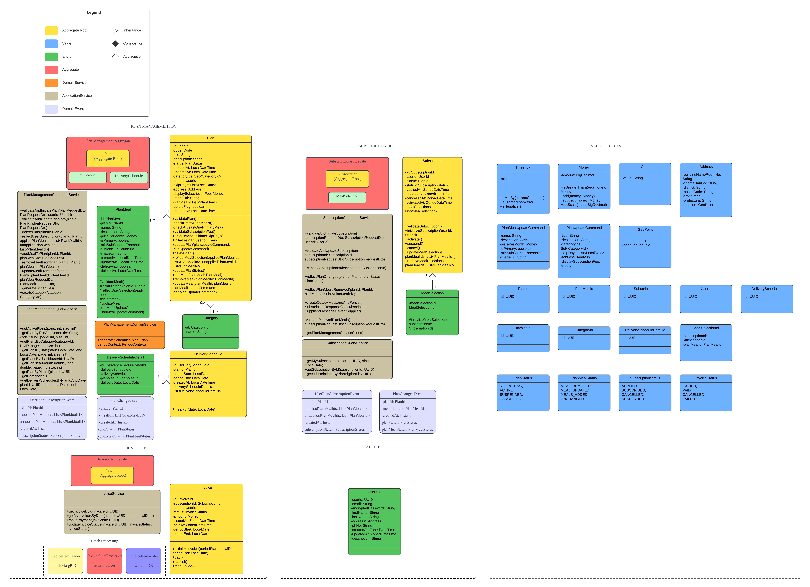
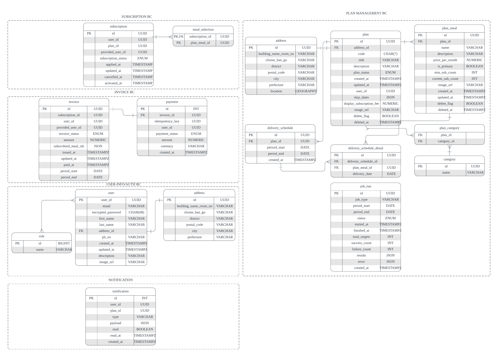
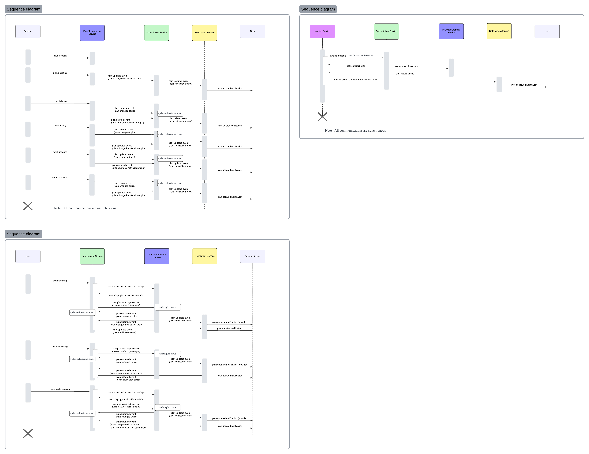
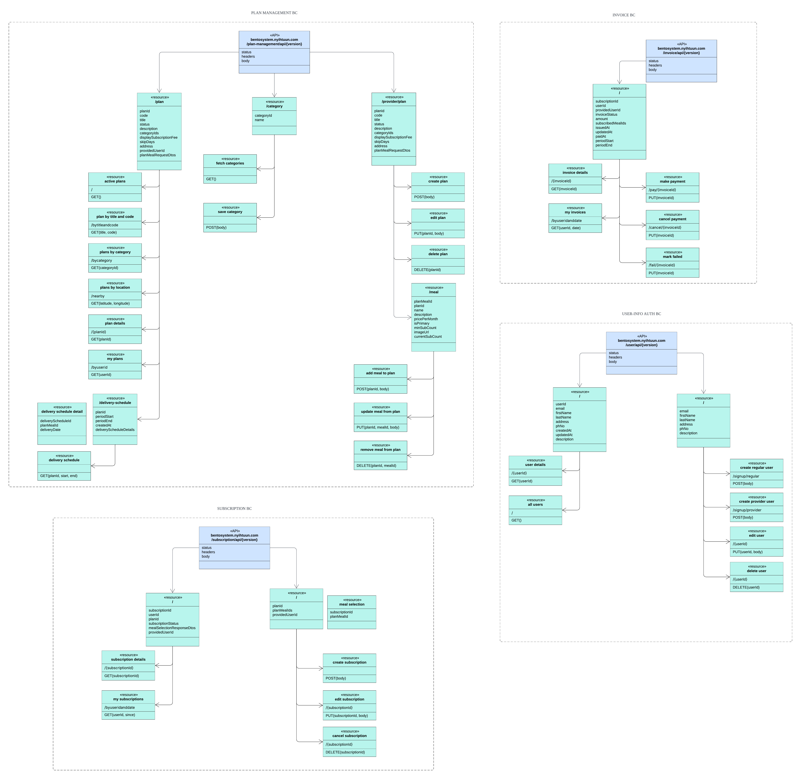
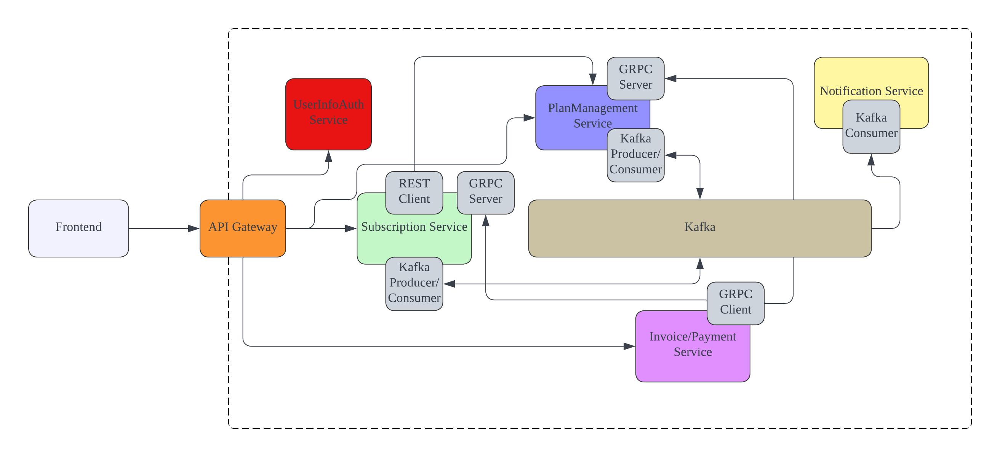
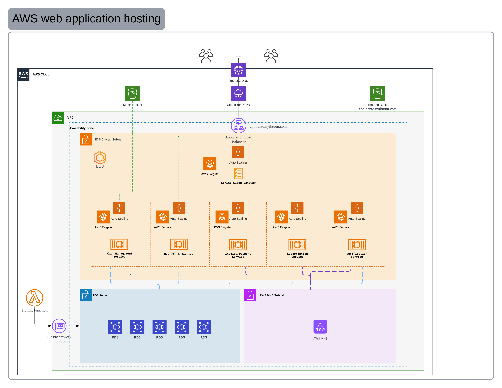

# Bento SaaS（ポートフォリオプロジェクト）

## 概要

本プロジェクトは、お弁当サブスクリプション型SaaS を題材としたポートフォリオ用システムです。

## プロジェクトの背景

レストラン運営している知合のお弁当プラン募集するSNS投稿をきっかけで本Saasを作ることになりました。「規模の経済性」の仕組みを基にした
クラウドファンディングWebアプリです。

## 解決したい業務課題

- 弁当プランを提供する側のプラン作成業務の簡素化、プランの登録者数、しきい値などのメトリクスの可視化
- 通常のユーザ側のサブスクリプション状態のトレース
- 一元的なインボイス・決済

## 機能一覧（ユーザー視点）

### 一般ユーザー

- アカウント登録・ログイン
- プランの検索・閲覧
- プランへの申し込み／解約
- サブスクリプション内容・スケジュールの確認・変更
- スケジュールの確認
- 請求情報の確認・決済
- 通知の確認（プラン状態変更・請求発行など）

### プロバイダー（店舗側）

- プランの作成・編集・公開／停止
- プランごとの登録者数・しきい値の確認
- 提供メニューの管理
- サブスクリプション状況の確認
- 通知の確認（プラン状態）

## 活用した技術・アーキテクチャー

- 限られた期間・リソースの中で、以下を示すことを目的としています。
  - 業務を中心に考えた Domain-Driven Design（DDD）思考やマイクロサービスアーキテクチャ
  - Hexagonal アーキテクチャ (Ports and Adapters)
  - イベント駆動アーキテクチャ
  - テスト駆動開発(TDD)に沿った開発
  - ロール別認証・認可
  - React を用いたSPAフロントエンドと、複数言語バックエンドによる ポリグロット構成
  - AWSクラウド環境へのデプロイメント
  - Lucidchart（Lucid App）を用いたアーキテクチャ図・ドメインモデル・シーケンス図の設計と事前構造化

## 設計プロセス

本プロジェクトでは、実装前に Lucidchart（Lucid App）を活用し、

- Bounded Context 分割のためドメインモデル図

  

- ER図

- イベントフロー設計のためシーケンス図

- API設計

- 論理構成設計

- デプロイメント設計

を作成しました。

設計を可視化した上で実装に進むことで、
責務の明確化・依存関係の整理・スコープ管理を意識した開発を行っています。

参考：[https://lucid.app/lucidchart/f3a5f07c-b1c7-44fc-bec1-cfcc255986e6/edit?view_items=he6kIxP1QUvn&page=.d6klyLuT6pN&invitationId=inv_9db2d31d-2d8f-463b-8b8b-3ef078517447](https://lucid.app/lucidchart/f3a5f07c-b1c7-44fc-bec1-cfcc255986e6/edit?view_items=he6kIxP1QUvn&page=.d6klyLuT6pN&invitationId=inv_9db2d31d-2d8f-463b-8b8b-3ef078517447)

⸻

## 技術スタック

- フロントエンド：React(TypeScript), HTML, Tailwind Css
- バックエンド：Spring Boot(Java), GoLang, Python(Lambda), Kafka, Docker, PostgreSQL, Stripe Payment, gRPC, Spring Batch
- インフラ : AWS(Fargate, ALB, Lambda, S3, Cloudfront, Route53, MSK)
- IaC : AWS CDK in Python
- セキュリティ : JWT
- 同期通信方式：HTTP（REST）
- 非同期通信方式：Kafka

## 工夫した点

- Outbox Pattern によりドメインデータ変更（ローカルDBのトランザクション）とイベント発行を同一トランザクションで扱えるように設計（整合性と再送性を担保）
- DDD により、業務ルール（ドメイン）とアプリケーション層・インフラ層を分離し、変更に強い構造を意識
- Eventual Consistencyが許せる部分は非同期（Kafka）によりイベント駆動を実現
- JWT のロールベース認可を前提に、Provider / User のユースケースを分けて設計
- 画像等の静的資産は S3 + CloudFront を想定し、アプリ側は URL／Presign 等で差し替え可能な構造を意識
- IaC（CDK）でインフラをコード化し、環境差分（dev/prod）の再現性とデプロイの見通しを確保
- 内部サービス間通信において、RESTよりもパフォーマンスを重視し、gRPC を採用、
  Plan / Subscription 間での複雑なデータ取得において、効率的な通信を実現
- バッチ処理（定期請求生成など）を想定し、Spring Batch を採用、
  ドメインロジックとバッチ実行基盤を分離し、将来的な定期処理・大量処理への拡張性を確保
- DBの初期化処理を行うスクリプトはCDKで実現が不可能であるため、AWS Lambda（Python）により実行

⸻

## フロントエンド（React UI）

想定画面

- ログイン・サインアップ
- プラン一覧・検索・詳細
- サブスクリプション状況確認・編集
- プラン作成・編集・キャンセル
- 請求書一覧
- 通知一覧（インアプリ）

⸻

バックエンド構成（Bounded Context）

Plan Management BC, Subscription BC (Spring Boot)

- プラン作成・管理
- サブスクリプション申込・状態管理
- 業務の中心となるドメイン

⸻

Invoice/Payment BC (Spring Boot)

- 請求書情報の管理
- ユーザーが請求状況を確認する及び決済を行うための BC

⸻

Notification BC（Go）

- ユーザー向け通知の管理
- インアプリ通知を提供

メール通知やプッシュ通知は将来拡張とし、
本プロジェクトでは対象外としています。

⸻

まとめ

本プロジェクトは、
限られた時間内でどのように設計判断を行うか を示すためのポートフォリオです。
